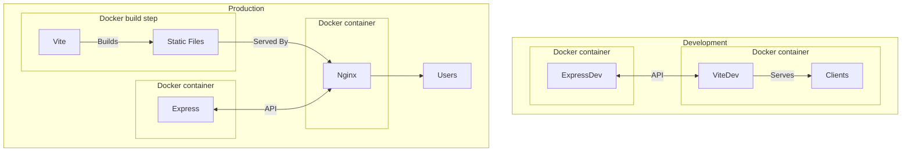

# Fullstack PureJs Template
This is a template repository to simplify the creation of full stack web projects using a minimal pure js environment.
- Tech Stack:
	- Node/Express => Backend/API
	- Vite => Dev server/Frontend builder
	- WebComponents => PureJs frontend "framework"
	- Nginx => Production server
	- PostgreSQL => Containerised Database (not yet implemented)
	- Docker => Easy build and run on any environment

## Quick Start
### Cloning the repository
This repository is meant to be used as a template in GitHub but if you want to clone the repository including the containerised Postgres submodule, here is the command:
```bash
git clone --recurse-submodule git@github.com:YoelRidgway/purejsfullstack.git
```
### Development
When in development mode, [ViteJs](https://github.com/vitejs/vite) will serve the frontend with live hot reloading on code changes and [NodeJs](https://github.com/nodejs/node) + [ExpressJs](https://github.com/expressjs/express) will power the backend using [Nodemon](https://github.com/remy/nodemon) to automaticaly restart the server on code changes.
```bash
# dev server will run on http://localhost:5173
docker compose -f docker-compose.dev.yaml up --build
```
This will create two [Docker](https://www.docker.com/) containers based on the Node image. `frontend` will serve the frontend files using Vite, and `backend` will be the API using ExpressJs.
### Production
In production, Vite will build the static files and [Nginx](https://github.com/nginx/nginx) will serve them from a 
```bash
# production server will run on http://localhost:80
docker compose up --build -d
```
Like development mode, this will create two containers (`frontend` and `backend`) with one running Express, but the other container will now build the frontend code using Vite and serve them using Nginx. This is because Nginx is better adapted and more performant when serving static files, it also decouples the backend and the frontend allowing the frontend and backend containers to be run on seperate environments.

### No Docker and Nginx
If you would like to build the application without using Docker, it can be done using the following steps:
1. `cd ./backend`
2. `npm run dev` or `npm start` in production
3. go to another terminal
4. `cd ./frontend`
5. `npm run dev` or `npm run build` to build files for production serving

It is up to you how you serve the static files after running these steps. They will be available in the [./frontend/build/](./frontend/build/) folder.

### Requirements
Only Docker !

### Implementation Details
I will make this better in the future but for now I will just list all the elements that I would like to expland
#### node_modules:
> I have added node_modules of both the backend and the frontend containers into an anonymous volume to avoid copying of node_modules into local filesystem (can cause issues with permissions when deleting also). However, it should be noted that empty node_modules will be created when running the containers. These can be safely ignored or deleted but will keep being created each time.
#### ports:
> Ports are all paremetrised internally as well as externally rather than being hard coded. Also the ports on the inside of a container is the same as the outside. The reason for this is to allow for the ports to be parametrised when not running with Docker. However, in order to do this, .env files will need to be made in each of the services/components (backend, frontend). Currently there is a root level .env file that helps the whole thing connect together without having to manually connect the backend port with the frontend.


## Architecture
This diagram is a bit useless and overcomplicates things but I spent time making it so keeping it here lol
